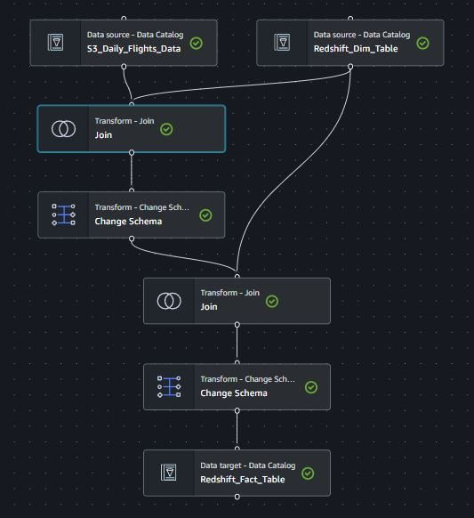

# **End-to-End Orchestrated Airlines Data Pipeline with AWS**

## **Project Overview**
This project focuses on building an end-to-end data pipeline for ingesting, transforming, and storing daily flight data in Amazon Redshift. The pipeline is fully automated, orchestrated with AWS Step Functions, and leverages a variety of AWS services including S3, Glue, CloudTrail, EventBridge, and SNS for error handling and notifications. The primary goal is to ingest daily flight data incrementally, perform transformations, and ensure the data is properly ingested into Redshift.

---

## Architecture Diagram

## **Tech Stack**
- **Amazon S3**: For storing daily flight data and airports data.
- **Amazon Redshift**: For storing transformed flight and airport data.
- **AWS Glue**: Used for ETL processing, schema discovery, and cataloging with Glue Data Catalog.
- **AWS Step Functions**: To orchestrate the pipeline.
- **AWS CloudTrail**: To track S3 data events that trigger the pipeline.
- **Amazon EventBridge**: To trigger Step Functions based on CloudTrail events.
- **Amazon SNS**: For error handling and notification purposes.

---

## **Key Features**
- **Incremental Data Ingestion**: Flight data is stored in an S3 bucket in partitioned format (`date=yyyy-mm-dd`). The pipeline ingests new files daily into Amazon Redshift incrementally.
- **Glue Data Transformation**: AWS Glue is used to transform the data by performing a join between the flights data and the airport dimension table. Glue Data Catalog plays a crucial role in managing metadata and tracking table schema versions.
- **Orchestration via AWS Step Functions**: AWS Step Functions orchestrate the entire data pipeline, ensuring each step (Crawler, Glue ETL, Redshift) is properly executed, with built-in error handling and retries.
- **Automated Triggering via AWS EventBridge**: New data uploads are detected via AWS CloudTrail, and the pipeline is triggered automatically using EventBridge rules.
- **Error Handling and Notifications**: SNS is integrated with Step Functions to notify on job success or failure, ensuring that the pipeline runs smoothly and any errors are promptly reported.

---

## **Pipeline Architecture**

### **Data Sources:**
1. **Airports Master Data:**
   - **Description**: A static dataset (CSV) containing information about airports (Airport ID, City, State, and Name).
   - **Ingestion**: Loaded into Redshift as the master dimension table using the `COPY` command from S3.

2. **Daily Flight Data:**
   - **Description**: A CSV file landed daily in an S3 bucket in partitioned format (`date=yyyy-mm-dd`).
   - **Columns**: `Carrier`, `OriginAirportID`, `DestinationAirportID`, `Departure Delay`, and `Arrival Delay`.

### **Amazon Redshift:**
1. **Airports Dimension Table:**
   - **Columns**: `Airport ID`, `City`, `State`, `Name`.
   - **Data Ingestion**: Populated from the airports CSV file using Redshift's `COPY` command from S3.

2. **Flight Fact Table:**
   - **Columns**: `Carrier`, `DepartureAirport`, `ArrivalAirport`, `DepartureCity`, `ArrivalCity`, `DepartureState`, `ArrivalState`, `DepartureDelay`, `ArrivalDelay`
   - **Purpose**: This table is populated incrementally with the transformed flight data after joining with the airport dimension.

### **Glue ETL and Glue Data Catalog:**
1. **Glue Crawlers:**
   - **Crawler 1 (S3 Daily Flights Data)**: Catalogs the daily flight data files in S3.
   - **Crawler 2 (Redshift Airports Dimension Table)**: Catalogs the schema of the Airports Dimension Table in Redshift.
   - **Crawler 3 (Redshift Flight Fact Table)**: Catalogs the schema of the Flight Fact Table in Redshift.

   The crawlers update the Glue Data Catalog, which maintains metadata, schema, and partition details for the data being processed. This catalog is essential for schema management and tracking         changes over time as new data arrives.

## Glue Visual ETL

### **Glue ETL Job:**
   - The ETL job uses **two input sources**:
   1. **Daily Flight Data** from S3.
   2. **Airports Master Data** from Redshift.
   - A **join operation** is performed on the `OriginAirportID` and `DestinationAirportID` to enrich the flight data with airport details (Name, City, State).
   - **Schema mapping** is applied to transform and format the data as per Redshift table requirements.
   - The transformed data is written into the Redshift `Flight Fact Table` incrementally using **Job Bookmarks** to track processed data.

## Step Functions 

### **Orchestration and Automation:**
## **Step Functions Workflow**

The data pipeline is orchestrated using AWS Step Functions, ensuring each component executes in the correct sequence.

### 1. **Start the Crawler:**
   - The state machine starts by invoking the S3 Crawler to catalog the newly arrived flight data.

### 2. **Crawler Status Check:**
   - A **Choice State** checks if the crawler has finished executing. If the status is `RUNNING`, a **Wait State** of 10 seconds is added before rechecking.  Once the crawler status is `SUCCEEDED`, the pipeline proceeds to the ETL step.

### 3. **Glue ETL Job Execution:**
   - The Glue ETL job is triggered for transforming the daily flight data and joining it with the airport dimension table in Redshift.

### 4. **Error Handling:**
   - If the ETL job fails, an **SNS Failure Notification** is triggered to notify via email.
   - If successful, an **SNS Success Notification** is sent to indicate pipeline completion.

### **Automation Using EventBridge & CloudTrail:**
   - **CloudTrail**: Configured to track data events for the S3 bucket where flight data lands.
   - **EventBridge Rule**: Triggers the pipeline based on CloudTrail events. Specifically, when a new `flights.csv` file is uploaded (either via `PutObject` or `CompleteMultipartUpload`), EventBridge triggers the Step Functions workflow. This ensures the entire pipeline is event-driven and starts automatically whenever new data is added to S3.

---

## **Detailed Workflow**
1. **New Data Arrives in S3**: The daily flight data lands in an S3 bucket in partition format (`date=yyyy-mm-dd`).
2. **CloudTrail and EventBridge**: CloudTrail detects the `PutObject` event in S3, and EventBridge triggers the Step Functions workflow.
3. **Step Functions Workflow**:
   - The workflow initiates the Glue Crawler for the daily flight data.
   - The Crawler updates the Glue Data Catalog with the latest flight data.
   - After the Crawler finishes, the Glue ETL job starts.
4. **Data Transformation in Glue**:
   - The Glue ETL job reads the daily flight data from S3 and joins it with the airport dimension table in Redshift.
   - The final transformed data is written incrementally into the Redshift Flight Fact Table.
5. **Completion Notification**:
   - If all steps succeed, an SNS notification for successful execution is sent.
   - In case of failure at any step, an SNS failure notification is triggered.

---

## **Conclusion**
This project demonstrates how to build a fully automated, event-driven data pipeline on AWS using Glue, Redshift, and Step Functions. The pipeline ensures efficient data ingestion, transformation, and storage with minimal manual intervention, making it highly scalable and reliable for handling daily data processing tasks.

